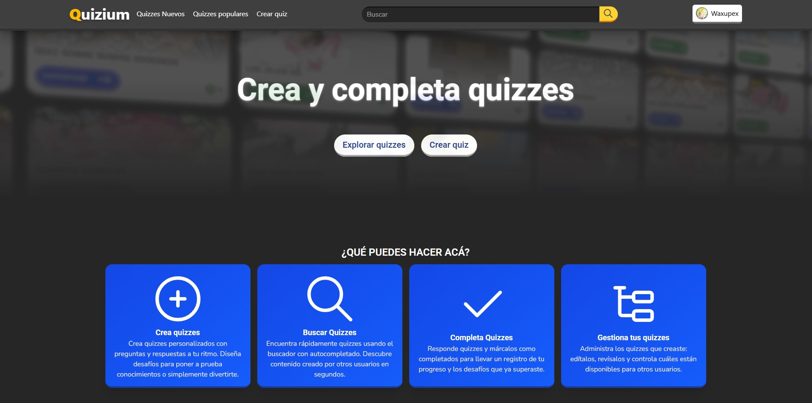

# Quiz app



- [Español](#Español)

- [English](#english)

## Español

Quiz App es una aplicación web de quizzes que permite a los usuarios crear, editar, eliminar y compartir cuestionarios con otros usuarios mediante una interfaz sencilla, moderna y totalmente responsiva.

## 🚀 Funcionalidades

- ✅ Registro de usuarios con verificación por correo electrónico
- 🔐 Autenticación segura
- 📌 Creación de múltiples quizzes
- 📝 Añadir preguntas y respuestas personalizadas
- ✔️ Completar quizzes creados por otros usuarios
- ↩️ Compartir tus quizzes fácilmente
- 🎨 Interfaz responsiva y moderna

## 🛠️ Tecnologías utilizadas

- **Laravel** (backend)
- **Inertia.js** (puente entre Laravel y React)
- **React** (frontend)
- **Tailwind CSS** (estilos)
- **SweetAlert2** (alertas e inputs modales)
- **Ziggy-js** (Manejo de rutas de Laravel en el frontend)

## 📦 Instalación local

1. Clona el repositorio

```bash
    git clone https://github.com/Pex-Dev/app-quiz.git
```

2. Instalar dependencias

```bash
    composer install
    npm install
```

3. Crea tu archivo .env

```bash
    cp .env.example .env
    php artisan key:generate
```

4. Configura tu base de datos y APP_URL en .env
5. Ejecuta migraciones y seeders

```bash
    php artisan migrate --seed
```

6. Levanta el servidor

```bash
    php artisan serve
```

7. Levanta vite (Frontend/Inertia)

```bash
    npm run dev
```

## 🌍 Sitio en vivo

- [Quizium.wuaze.com](https://quizium.wuaze.com/)

## English

Quiz App is a web-based quiz application that allows users to create, edit, delete, and share quizzes with other users through a clean, modern, and fully responsive interface.

## 🚀 Features

- ✅ User registration with email verification
- 🔐 Secure authentication
- 📌 Create multiple quizzes
- 📝 Add custom questions and answers
- ✔️ Complete quizzes created by other users
- 🔗 Easily share your quizzes
- 🎨 Modern and responsive UI

## 🛠️ Built with

- **Laravel** (Backend)
- **Inertia.js** (Bridge between Laravel and React)
- **React** (Frontend)
- **Tailwind CSS** (Styling)
- **SweetAlert2** (Styling)
- **Ziggy-js** (Named route handling from Laravel in the frontend)

## 📦 Local installation

1. Clone the repository

```bash
    git clone https://github.com/Pex-Dev/app-quiz.git
```

2. Install dependencies

```bash
    composer install
    npm install
```

3. Create the .env file

```bash
    cp .env.example .env
    php artisan key:generate
```

4. Configure your database and APP_URL in .env
5. Run migrations and seeders

```bash
    php artisan migrate --seed
```

6. Start the backend server

```bash
    php artisan serve
```

7. Start Vite (Frontend / Inertia)

```bash
    npm run dev
```

## 🌍 Live site

- [Quizium.wuaze.com](https://quizium.wuaze.com/)
